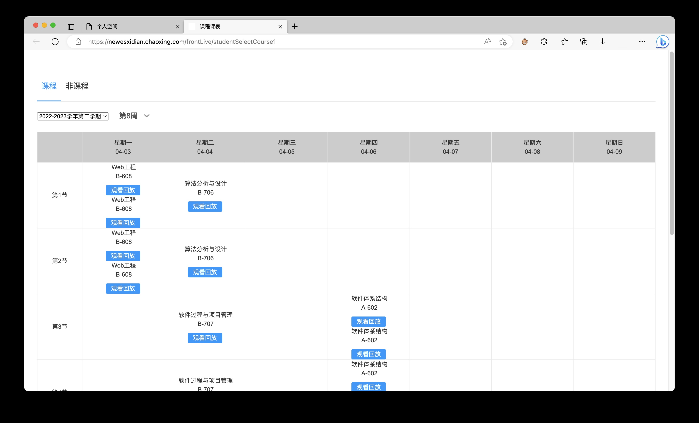

# 西电课程录播小助手

## Prerequisites

你的电脑上需要安装 [Docker](https://www.docker.com/products/docker-desktop/)

如果你是 Windows 用户，还需要安装 [PowerShell 7](https://learn.microsoft.com/en-us/powershell/scripting/install/installing-powershell-on-windows#install-powershell-using-winget-recommended):

```powershell
winget install --id Microsoft.Powershell --source winget
```

另外，为了最好的使用体验，建议你安装 `pasteboard`。

如果你已经安装了 [`scoop`](https://scoop.sh/)，那么可以用 `scoop` 安装：

> `scoop` 是 Windows 上的第三方包管理器

```powershell
scoop bucket add extras
scoop install pasteboard
```

或者下载[压缩包](https://github.com/uzxmx/pasteboard/releases/)，将解压文件放到环境变量 `Path` 下的目录中。

你可以通过在 PowerShell 中执行 `$Env:Path -split ';'` 命令来查看环境变量 `Path` 中的目录，或者执行 `$Env:Path += ';C:\Tools'` 来向环境变量 `Path` 中增加一个目录。

## How to use

首先在 [releases](https://github.com/Undefined443/Course/releases) 中下载需要的脚本文件，如果你是 Windows 用户，请下载 `course.ps1`，如果你是 `macOS/Linux` 用户，请下载 `course.sh`。

将下载的文件放到一个新目录中，并在该目录中新建文件 `config.yaml`，在其中中填入你想记录的课程。例如：

```yml
jy: 就业指导
web: Web工程
gj: 构件与中间件技术
sf: 算法分析与设计
spm: 软件过程与项目管理
xt: 系统分析与设计
rj: 软件体系结构
```

### 获取课程 JSON

1. 打开 Microsoft Edge 或 Google Chrome，进入超星学习通（西电智课），在侧边栏进入应用中心，在应用中心中打开录直播应用（学生）。


> 如果你找不到录直播应用，点击右上角的头像，选择 `切换单位`，然后选择 `西电智课平台(学生,本科生)`

2. 在录直播应用中找到你想要记录的课程，点击查看回放。



3. 在回放界面按下 <kbd>F12</kbd> 打开开发人员工具，在开发人员工具最上方的标签栏中选择 `网络`，然后在搜索框中输入 `index`。


4. 单击唯一的搜索结果（如果没有就刷新一下页面），在打开的界面中选择 `负载` 标签，然后在下面的内容上单击鼠标右键，选择 `复制值`。


### 记录课程

现在，打开终端，进入该目录，运行一些命令试试吧！

```sh
./course sf 5-2 $(pbpaste)  # 记录一节算法课，课程标记为 5-2-1，课程 JSON 通过命令替换从剪贴板读出

./course show web ls  # 查看已记录的算法课，输出为课程的标记

./course show web 5-2  # 查看已记录的算法课中标记为 5-2 的所有课程的 URL

./course download web 5-2  # 下载算法课中标记为 5-2 的所有课程
```

> 对于 macOS/Linux 用户，运行脚本时需加上后缀 `.sh`，即：`./course.sh`
> 
> 每个记录的课程 URL 都必须有一个标记，如 `5-2-1`，表示这节课是第五周星期二的课程。所有在第五周星期二上的这门课的 URL 都会放到一个数组中，后面的 `1` 是这个课程 URL 在数组中的索引（数组索引从 1 开始）。在记录、查看和下载课程时可以省略索引，此时程序会在后台自动补充索引。

## Troubleshooting

### 第 3 步搜不到 index

超星录播同步很慢，可能是这门课的录播还没有生成出来，等几天再试试。最长可能需要两周。

### 其他

可能是网络问题，请挂代理或更换节点，出站规则选择规则判断。
